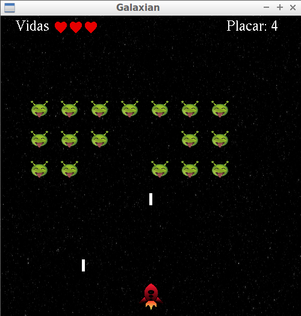

# c-opengl-game
Game made entirely in C with OpenGL. It has only been tested on debian.
## Demo
### Video: https://www.youtube.com/watch?v=Lt8l_hjmREM

### Print:
  

## Dependencies
```sh
sudo apt-get install freeglut3-dev 
sudo apt-get install libglew-dev 
sudo apt-get install libsoil-dev 
```
gcc is also needed
## Run
Clone this project, then enter that folder and run:
```sh
gcc main.c -lGL -lglut -lGLEW -lSOIL
./a.out
```
